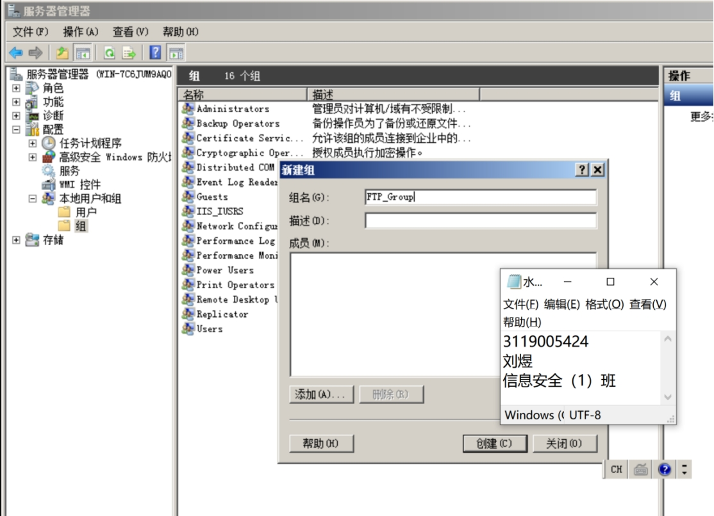

### 2. Wireshark sniffing packet capture and analysis

##### **一、** Purpose of the experiment

1. Master how to use the protocol analysis tools to analyze the IP datagram message format and experience the process of sending and forwarding datagrams. During the learning process, you can visualize the specific transmission process of data.

​       By analyzing the information in the header of intercepted TCP messages, you will understand that the fields in the header, such as the serial number and the acknowledgement number, are the basis for a reliable TCP connection. Understand the TCP connection establishment and release mechanism by analyzing the three handshake establishment and release process of Wireshark connections.

​	2．Capture packets using Wireshark (Ethereal).

3. Analyze the captured packets and consolidate the knowledge of Ethernet II packets, ARP grouping and IP and ICMP packets through analysis.

##### **二、**Experimental content and requirements

1) Learn the basic usage of the protocol analysis tool Wireshark.
2) Analyze the start and end addresses of any IP packet captured, as well as the start and end addresses of the corresponding MAC frames, the value of the TTL, the contents of the protocol fields, and analyze their significance.

3) Use Wireshark to listen to ICMP packets and analyze the main functions of the ping and tracert programs. For any ICMP packet caught, analyze the interrelationship between its MAC frames, IP packets, and ICMP packets.

4) Using Wireshark to listen to arp packets and analyze the contents of arp request and reply packets.

##### **三、** Experimental results

**1）IP Information**

Target machine: 192.168.240.129

Attack machine: 192.168.240.130

Host machine: 192.168.240.1

 

**2) Turn on FTP service of target machine**

Create user group: FTP_Group

 

Figure 2.1 Creating user group FTP_Group

 

Create a new user FTPUser1 with the password ftp_user1

 

Figure 2.2 Creating new users

 

Modify affiliation group 

Figure 2.3 Modifying affiliation groups

 

Installation of FTP server

IIS server

 

Figure 2.4 Installing IIS server

 

 

Figure 2.5 IIS server installation completed

 

Configure the FTP server

 

Figure 2.6 Configuring FTP Server

 

Bind IP address and check No SSL certificate required

 

Figure 2.7 Configuring IP address

 

 

Select basic authentication (account password authentication) and authorize read and write access to the FTP_Group group

 

 

Figure 2.8 Grant read and write permissions to FTP_Group group

 

Set FTP directory permissions to grant read and write permissions to FTP_Group

 

Figure 2.9 Setting FTP directory permissions

 

Connection Verification

Local browser input: [ftp://192.168.240.129](ftp://192.168.40.135), input account password to verify

 

Figure 2.10 Connection Verification

 

**3) The attacker opens wireshark to capture packets**

 

 

Figure 2.11 attack machine open wireshark capture packets

 

Analyzing ICMP protocol packets for ping

 

Figure 2.12 Analyzing ICMP protocol packets for ping

The figure shows the TTL and protocol type, the source and destination addresses, the ICMP request packet

 

Viewing ARP packets

 

Figure 2.13 Viewing ARP packets

 

 

 

Figure 2.14 Viewing ARP packets

 

ARP protocol to resolve IP addresses into MAC addresses, in Wireshark can be seen, first through the Broadcast (Broadcast) to send a packet request to resolve the MAC address of 192.168.240.2, at this time 192.168.240.2 MAC address is 0. When 192.168.240.2 received the packet, respond to a response packet At this time, 192.168.240.1 updates the corresponding mapping.

 

Figure 2.15 Viewing ARP packets

 

 

 

 

**4) Local host access to target machine FTP**

 

Figure 2.16 Local host accessing target machine FTP

 

**5) Using Wireshark to capture host access to target machine FTP packets**

 

From the packet capture data, it can be seen that the data transmission is not encrypted and the user name and password can be obtained

 

Figure 2.17 Grabbing host access to target machine FTP packets with Wireshark

 

 

 

##### **四、** Post-test reflections

1. Use Wireshark to listen to the HTTP access process, find out the IP data messages related to the three handshakes of TCP to establish a connection, and parse the process of the three handshakes of TCP to establish a connection, and the changes in the IP data messages.

A: The three TCP handshakes are as follows.

First handshake: when establishing a connection, the client sends a syn packet (syn=j) to the server and enters the SYN_SEND state, waiting for the server to confirm. 

SYN: Synchronize Sequence Numbers

second handshake: the server receives the SYN packet, must confirm the client's SYN (ack=j+1), while sending a SYN packet (syn=k), that is, SYN + ACK packet, at this time the server enters the SYN_RECV state. 

The third handshake: the client receives the server's SYN + ACK packet, sends a confirmation packet ACK (ack=k+1) to the server, this packet is sent, the client and the server enter ESTABLISHED state, completing the three handshakes.

 

The process of TCP release handshake. 

TCP client sends a FIN flag to close the data transmission from the client to the server side. 

The server side receives this FIN flag and sends back an ACK flag, acknowledging the sequence number as the received sequence number plus 1. 

(b) The server side closes the connection of the client and sends a FIN flag being sent by the client. 

The client side sends back an ACK message to confirm and sets the confirmation serial number to the received serial number plus 1.

 

2. Try to catch the TCP packets whose target address is the next classmate host, can you catch them? What types of packets can be caught? Why?

	

A: No, because only the TCP packets of the local machine can be captured, the MAC address and IP address of each host is already bound, and the packets can only be sent to the host with the request instruction.

 

3. Login to some systems on the Internet, try to get the user name and password, and observe whether the password of these systems is in plaintext or ciphertext form?

 

A: Most of them are in plaintext form, but it actually depends on whether the website is using HTTP protocol or HTTPS protocol, HTTP protocol transmits the password in plaintext, HTTPS transmits it in ciphertext.

 

 

4. Use the Ping large packet command to examine the fragmentation of packets and analyze the fields related to fragmentation.

A：As shown in the figure below

 

 

Figure 2.18 Using the Ping large packet command to examine packet slicing

 

Figure 2.19 Analyzing the fields related to slicing

 

5. How can you catch all the packets in the current network environment of your virtual machine?

 

 

##### **五、** Experimental experience

I got familiar with the use of wireshark, learned how to set up FTP server, learned how to write filtering rules and how to read key information of packets. Learned the characteristics and differences of the three modes of network connection of VMWare, reviewed and consolidated the process of opening the ftp service of IIS. Analyzed the FTP transmission without encryption through Wireshark packet capture.