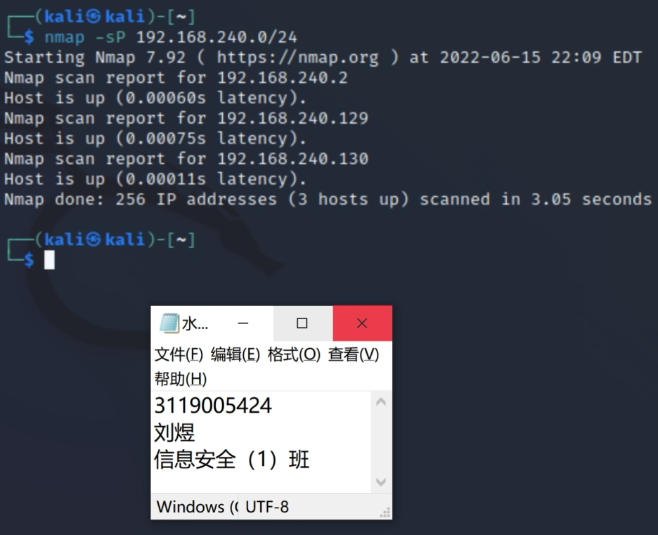
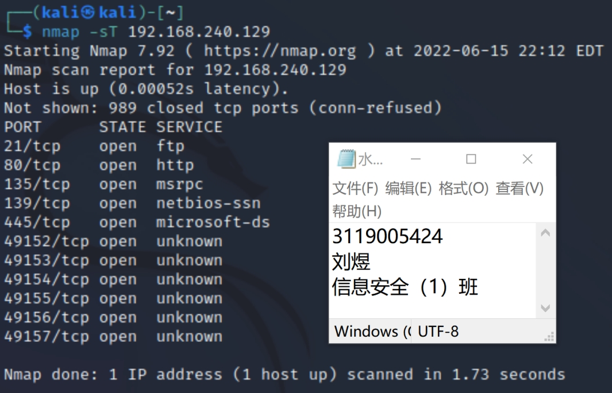
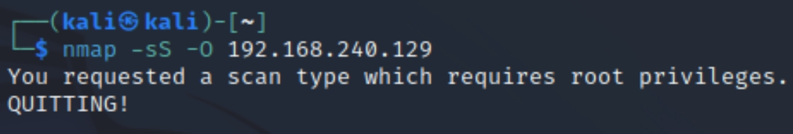
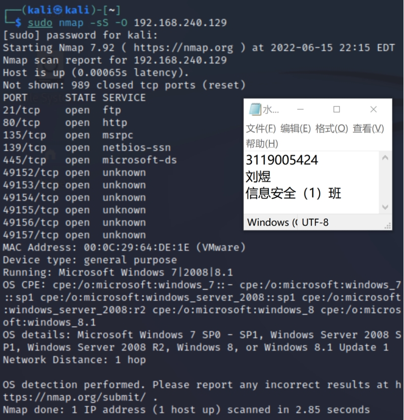
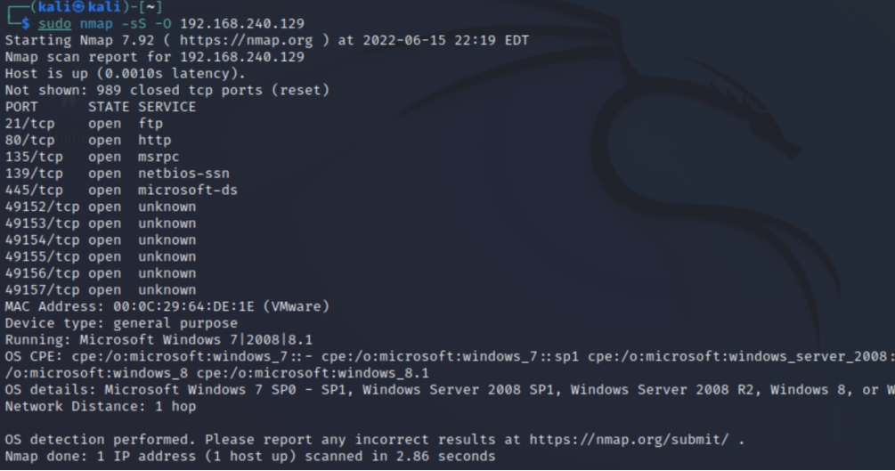
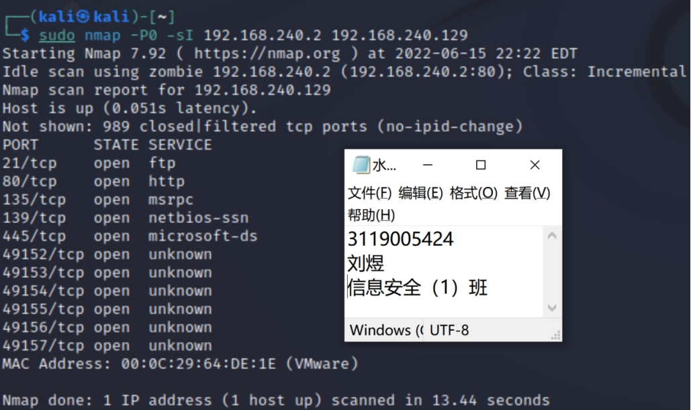
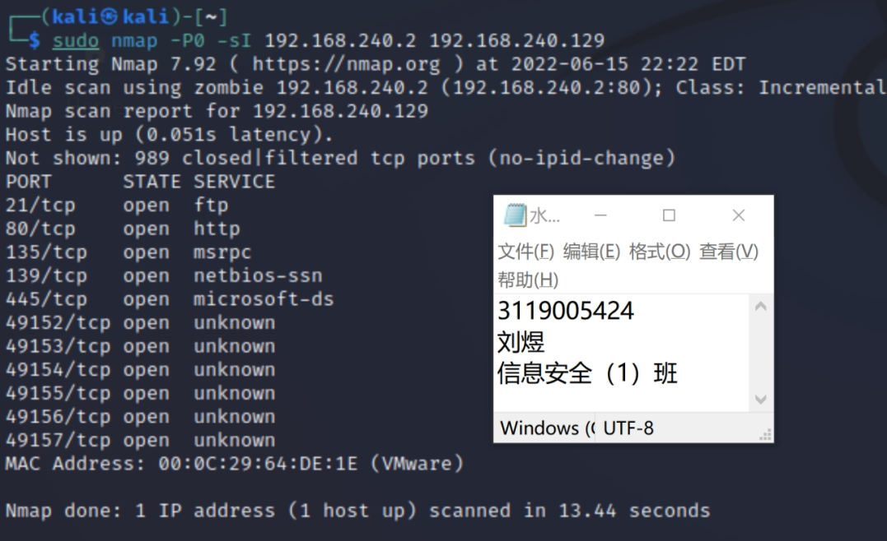
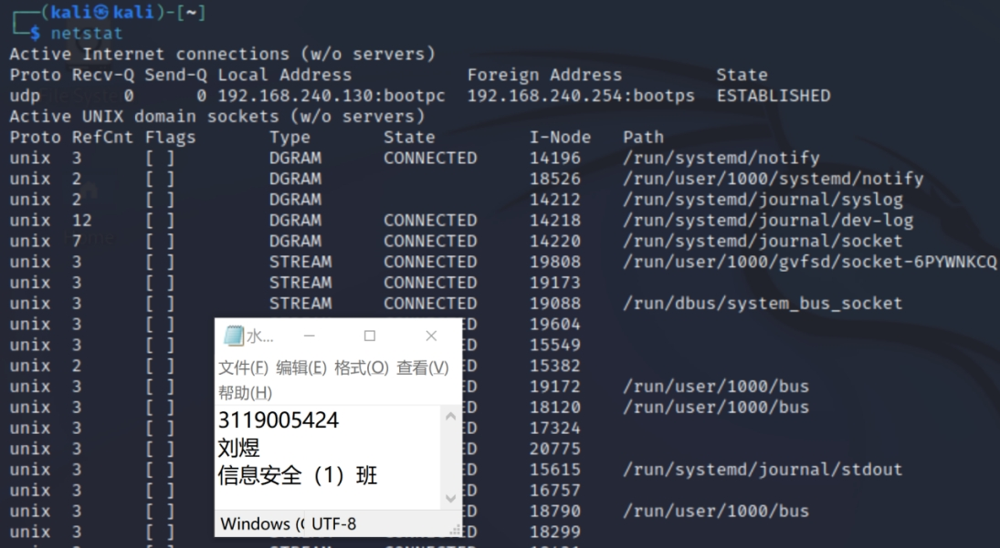
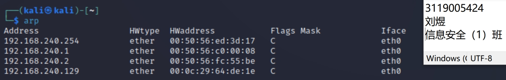
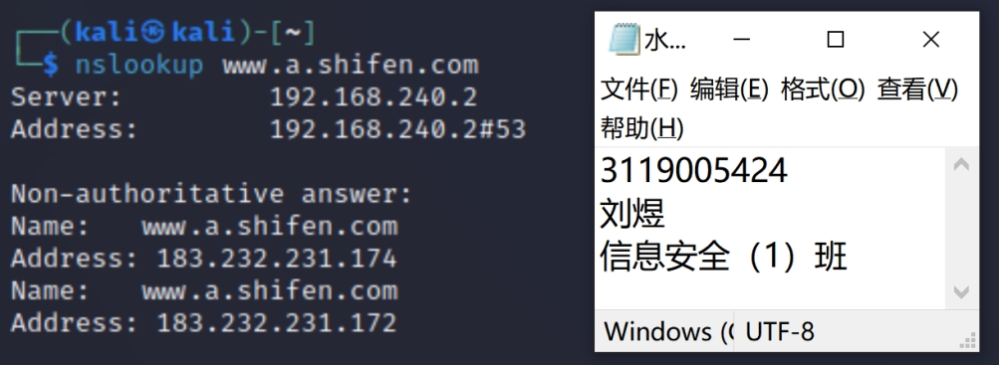

### 3.Nmap Network Scan Tool Usage

##### **Purpose of the experiment**

Learn to perform network protocols in Kali system, use the Nmap command tool to perform network protocol scanning, and use netstat, arp, and nslookup commands to view network status.

This experiment is to enable students to better understand the basic operations of computer network setup and to master the basic monitoring techniques of computer network configuration.

##### **一、** ***Experimental content and requirements***

1、Use Nmap tool to perform TCP scan, TCP indirect scan, UDP scan, etc. (refer to the textbook experiment 4-3).

2、Use Arp tool and record the relevant information.

3、Use Nslookup tool and record the relevant information.

##### ***二、** Experimental results*

\1) nmap -sP 192.168.240.0/24

 

Figure 3.1 View the running machines in the LAN

Principle: Nmap sends an ICMP echo and an ACK to each scanned host, and the host gets a response to either one.

Purpose: To detect which hosts are running in the LAN.

Result Analysis: You can check the machines running in the LAN.

 

 

\2) nmap -sT 192.168.240.129

 

Figure 3.2 Getting information about the open ports of the host

Principle: Nmap will use the connect() system call to open a connection to the relevant port on the target machine and complete three TCP handshakes.

Purpose: Find a running machine 192.168.40.135 and perform a TCPconnect() port scan.

Analysis of results: get information about the open ports of the 192.168.40.135 host.

 

\3) nmap -sS -O 192.168.240.129

 

Figure 3.3 Insufficient permissions

sudo nmap -sS -O 192.168.240.129

 

Figure 3.4 Scanning for hosts/networks

Principle: The "-sS" command will send a SYN scan to probe a host or network. A SYN scan is started by sending a SYN packet (which is the first packet in the TCP protocol). Any open port will have a SYN/ACK response. However, the attacker sends an RST instead of an ACK, and the connection is aborted. The triple handshake is not implemented, and few sites log such probes. In the case of a closed port, the corresponding response to the initial SYN signal will also be an RST, letting the NMAP know that the port is not listening.

Purpose: Scanning with a half-open SYN token prevents, to a certain extent, identification and logging by the target host of the scan. 

\4) sudo nmap -sS -O 192.168.240.129

 

Figure 3.5 Using different responses to discriminate systems

Principle: To identify systems by using different responses of different systems to different types of probe signals from nmap.

Purpose: To test the system type of the target host.

Result analysis: The system of the target host was obtained as windows 2008.

 

 

\5) sudo nmap -P0 -sI 192.168.240.2 192.168.240.129

 

Figure 3.6 Scanning the target machine to hide their information

Principle: (1) The attacker keeps sending probe packets to the zombie host and performs IP ID value analysis.

(2) If the port is open, the target host sends SYN/ACK packets to the zombie host, and these results affect the IP ID value of the packets sampled by the attacker.

(3) The attacker sends spoofed TCP SYN packets to the designated port of the target host, making the source address appear to be the zombie host.

Purpose: Use zombie host 192.168.240.2 to scan 192.168.240.129 to hide their information.

 

\6) sudo nmap -sS -P0 -D 192.168.240.10,ME,192.168.240.30 192.168.240.129

 

Figure 3.7 Fake multiple attack hosts scanning at the same time

Purpose: fake multiple attack hosts simultaneously launched on the target network probes and port scanning, this approach can make the IDS alarm and logging system failure.

Result Analysis: Fake multiple hosts on the target host: 192.168.40.135 to scan, and get the results.

 

 

7) Use the netstat command to view network status

 

Figure 3.8 Checking the network status

 

8) Use the arp command to log relevant information

 

Figure 3.9 Using arp command to record related information

You can see the mapping table of IP addresses and MAC addresses of hosts that have established network connections

 

9) Use the nslookup tool to record relevant information

 

The nslookup command is used to query the DNS records to get the IP address and other information for the domain name.

 

##### ***三、 Experimental experience***

Through this experiment, we are familiar with several parameters commonly used for nmap scanning, the use of common nmap commands and tools, and further understanding of the role of the nslookup command. Initially experienced the difference between TCP scan, TCP indirect scan and UDP scan.