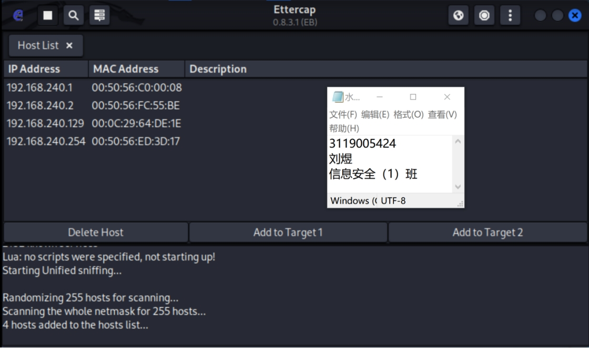
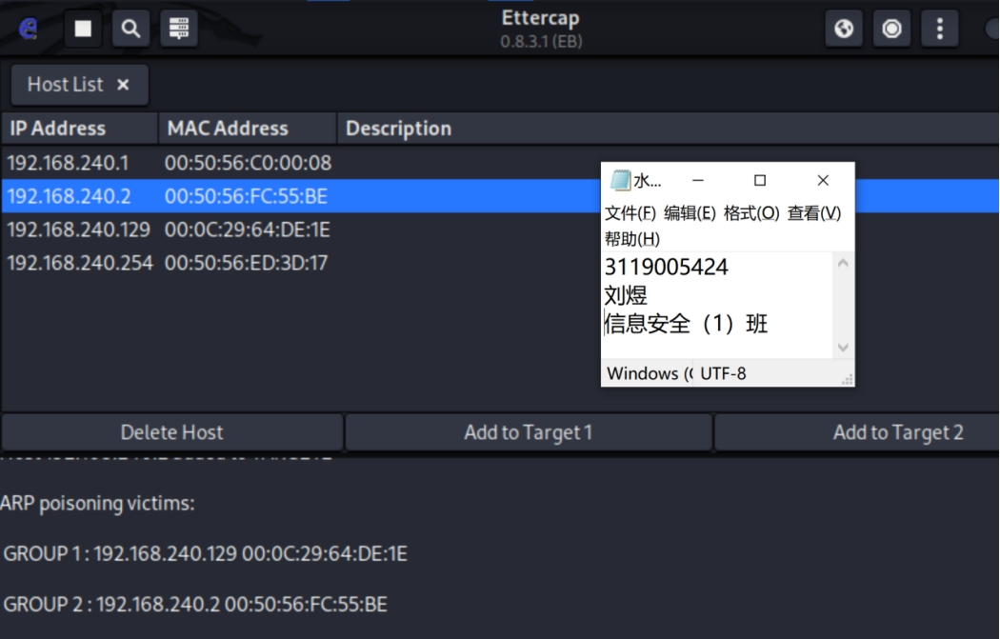
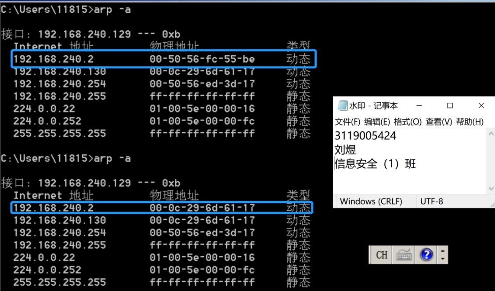
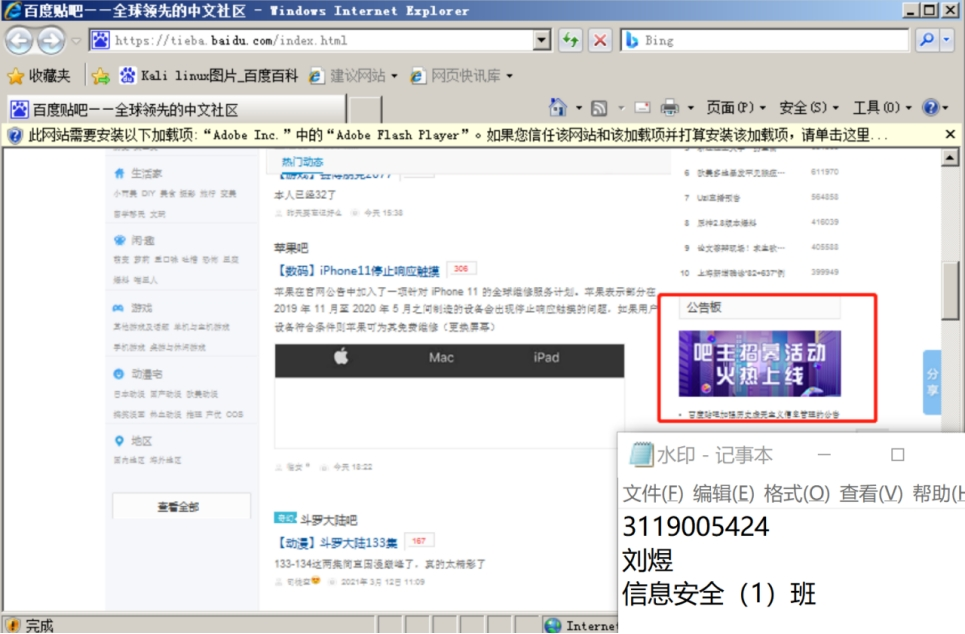
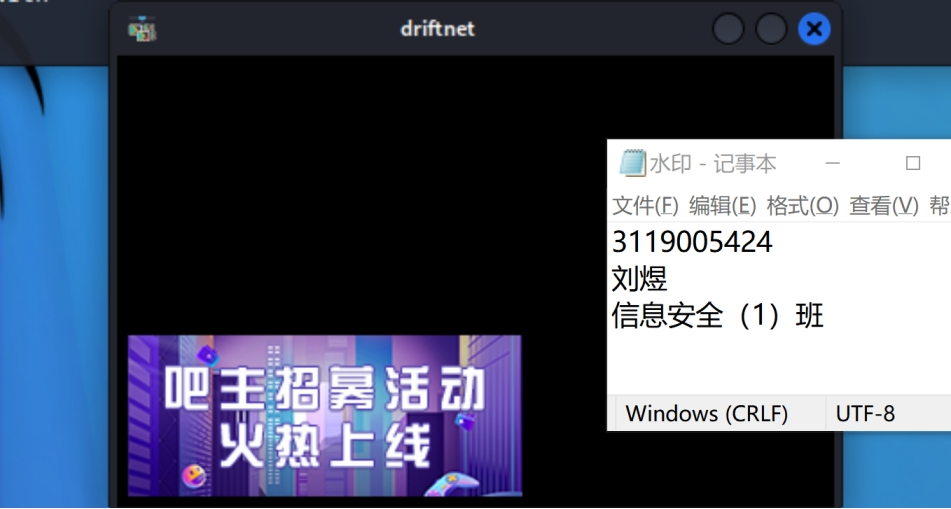

### 4. Intercepting image data streams with driftnet

##### ***I. Experimental purpose***

Learn to enable linux virtual machine configuration kali in Windows system and use kali tool ettercap to achieve real ARP spoofing operation and can actually intercept the picture data stream of the attacking machine.

This experiment is to enable students to better understand the basic operation of computer network ARP spoofing attack, master the principle and efficacy of computer network ARP attack.

##### ***II.the experimental content and requirements***

1、Installation environment, linux environment and kali environment.

2、Use ettercap to implement ARP attack and intercept the image data stream.

##### ***III. Experimental results***

1) Start ettercap on kali and sniff the hosts in the network segment

 

Figure 4.1 Sniffed hosts

 

2) Add the target machine IP to Target1 and its default gateway IP to Target2, start ARP poisoning. to perform ARP spoofing on the target machine.

 

图4.2 对靶机进行ARP欺骗

 

3）靶机的ARP表

 

Figure 4.3 Comparison of physical addresses before and after spoofing

 

 

4) Enter the command driftnet -i eth0 

When the target machine accesses the web page to load the image, it can be sniffed and displayed by the attacking machine.

Target machine.

 

 

 

Figure 4.4 Accessing the website on the target machine

 

 

Figure 4.5 Attacker intercepted pictures

 

##### ***IV. the experimental experience***

This experiment is based on the implementation of ARP spoofing attack, through this experiment mastered the use of ettercap, using ettercap for ARP spoofing, and using driftnet to intercept the image stream. However, the pictures on the web page are displayed too slowly to be displayed in real time, so the command is replaced to save the captured pictures in the specified folder, and the attack machine succeeds after the target machine browses a few pictures for some time.