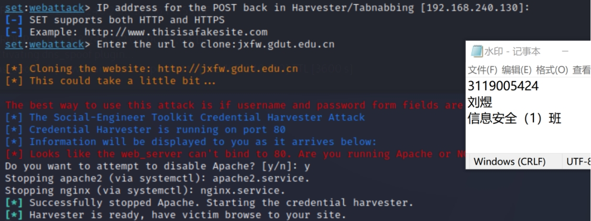
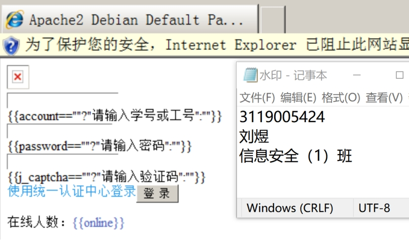

### **5.Implementing phishing**

##### ***I、Purpose of the experiment***

Learn to enable linux virtual machine configuration windows 2008 in Windows system and use kali tool ettercap to achieve real DNS spoofing operation and be able to do real phishing.

This experiment is to enable students to better understand the basic operation of DNS spoofing attacks on computer networks and to master the principles and efficacy of DNS spoofing attacks on computer networks.

 

##### ***II、Experimental content and requirements***

1、Installation environment, windows 2008 environment.

2、Use ettercap to implement DNS attack.

3、Implement DNS spoofing + website cloning to achieve website phishing attacks, using social engineering attack tools.

 

##### ***III、Experimental results***

1）First edit ettercap's dns configuration file

Figure 5.1 Editing the dns configuration file requires sudo privileges

 

2）Resolve the domain name [www.baidu.com](http://www.baidu.com) DNS to the IP address of the kali machine

 

Figure 5.2 DNS resolution to the IP address of the kali machine

 

3）Modify the index.html file of the local http service to be accessed by the target machine for a while.

 

Figure 5.3 Modifying the index.html file

 

4）Modify an element in a web page

 

Figure 5.4 Modifying an element in a web page

 

5）Open the Apache service of kali, after opening, you can enter the IP of kali machine in the target browser to access the web page, and if you can access, the Apache service is successfully opened.

 

 

Figure 5.5 Starting kali's Apache service

 

6）Open Ettercap for DNS spoofing

Add the default gateway IP of the target machine to GROUP1 and add the target machine IP to GROUP2

 

Figure 5.6 Adding a gateway in ettercap

 

 

Figure 5.7 Loading the dns_spoof plugin

 

 

Figure 5.8 ARP table of the target machine after ARP spoofing

 

7）After DNS spoofing, the target machine visits www.baidu.com and successfully accesses the index.html of the previously set apache service on the kali machine, and DNS spoofing is successfully executed.

 

Figure 5.9 DNS spoofing big success

 

##### ***Website cloning with setoolkit***

1）Open the tool by typing setoolkit in the terminal

 

Figure 5.10 Enabling social engineering attack tools

2）Type 1 to select Social Engineering Attack

 

Figure 5.11 Social Engineering Attack

3）Type 2 to select the site to attack

 

Figure 5.12 Clone Web Attack

Enter the cloned web interface, enter to continue; enter the URL you need to copy: jxfw.gdut.edu.cn

enter OK, the phishing website is built

 

Figure 5.13 Cloned website build completed

 

Launch ettercap and perform DNS spoofing on the target machine

The target machine visits the phishing website

 

Figure 5.14 The target machine visits the cloned phishing website

 

The target machine enters login information: user name, password, and authentication code

 

Figure 5.15 Entering login information

Setoolkit obtains the login field information of the target machine

 

Figure 5.16 Login information is captured

##### ***IV、 Experimental experience***

Due to the browser's cache and the target machine's cache led to spoofing failure, clearing it succeeded; the second step encountered some problems, and then updated the setoolkit command apt- get install set, and then tried the original steps on success. At the same time, at the beginning of the experiment, did not turn off the firewall of the target machine, and then the ARP table of the target machine was spoofed or did not succeed in DNS spoofing, and then successfully achieved DNS spoofing after turning off the firewall. Through this experiment learned to build phishing sites, as well as the use of phishing sites to obtain user information.