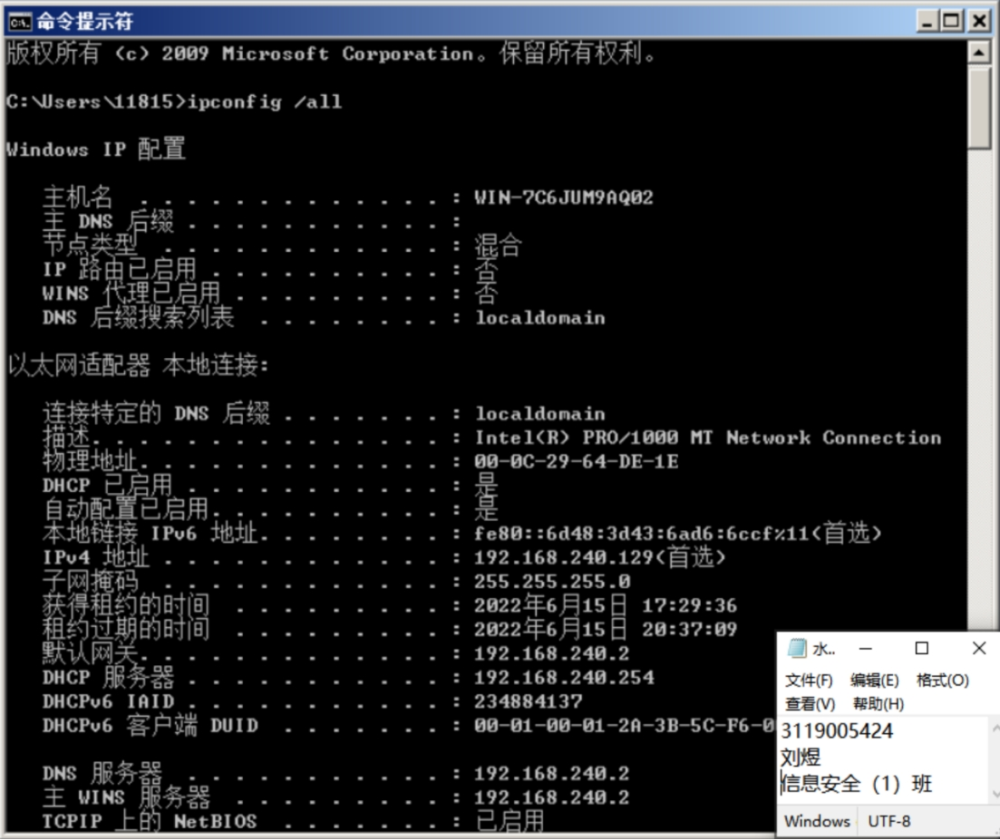
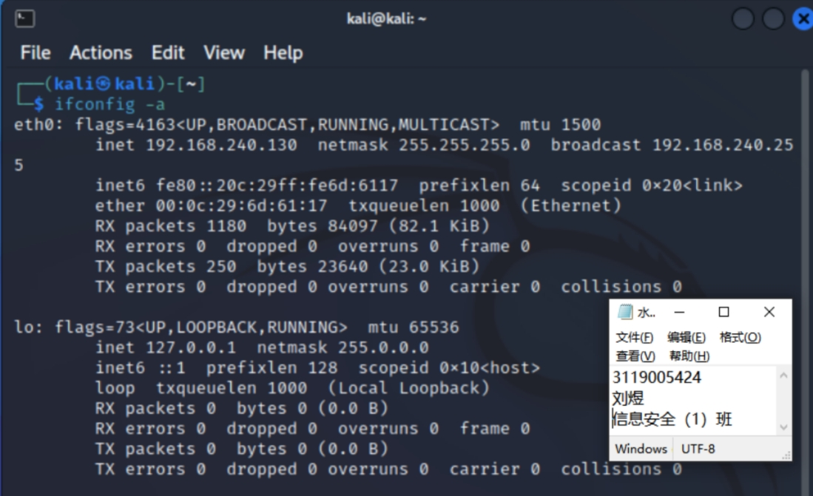
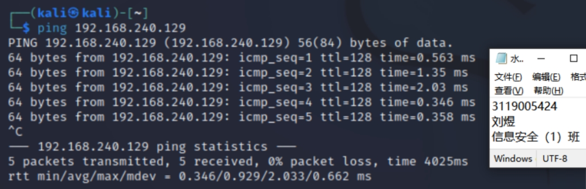
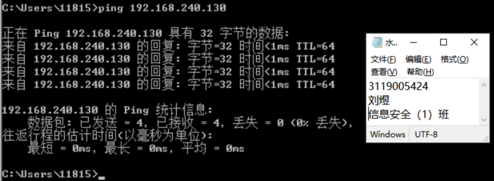
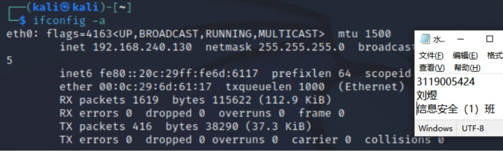
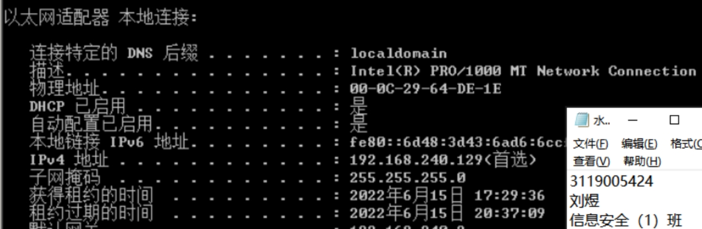

### 1. Build attack and target aircraft environments

##### **一、** Purpose of the experiment

1）Learn to build a simple offensive and defensive environment in a computer.

2）This experiment is designed to provide students with a better understanding of the various roles of network attack and defense techniques and to master the environment of attack and target machines.

##### **二、**Experimental content and requirements

1、Install VMware.

2、Install Kali operating system in VMware and mark it as the attack machine.

3、Install windows 2008 operating system in VMware and mark it as the target machine.

4、Use the ping command to check the ip of the attacking machine and the target machine.

##### **三、** Experimental results

**1）Kali linux**

 

Figure 1.1 Kali linux   installation completed

 

 

 

 

**2）Windows server 2008 R2**

 

Figure 1.2 Windows 2008 installation completed

 

**3）Using the ping command to check the ip of the attacking and target machines**

First check the IP address of Kali linux

 

Figure 1.3 IP address of Kali machine

Kali machine ping through the target machine

 

Figure 1.4 Kali machine Ping through the target machine

 

 

 

Target machine Ping through Kali machine

 

Figure 1.5 Target machine Ping through Kali machine

 

 

##### **四、** Experimental experience

The Kali machine and the target machine Win2008 were previously installed in VMWare for the corresponding experiments, so the basic configuration is still in place. Here the two virtual machines network mode is selected NAT mode.

 

##### **五、**Questions and Discussions

1. How to test if there is a fault in the connection from your host to a specific URL? If there is a failure, how to further analyze the cause of the failure?

A: Use a browser to test if you can access the Internet normally or use the ping command to test if you can ping the host or a specific URL (i.e., the network is connected). If there is a connection, pinging the specific URL should receive a response packet and have data displayed. If there is packet loss or the host is not found, the connection is faulty. Wrong IP address setting; the other party is not in the same network segment with itself, and cannot find the other party through the route, but sometimes the other party does exist, and of course does not exist is also returned a timeout message; the other party does exist, but set ICMP packet filtering (such as firewall settings).

 

 

2. What are the Ethernet addresses of the two Vmware machines?

A: Kali machine: 00 : 0c : 29 : 6d : 61 :17

 

Figure 1.6 kali machine Ethernet address

 

Windows server 2008：00-0c-29-64-DE-1E

 

Figure 1.8 Target machine Ethernet address

